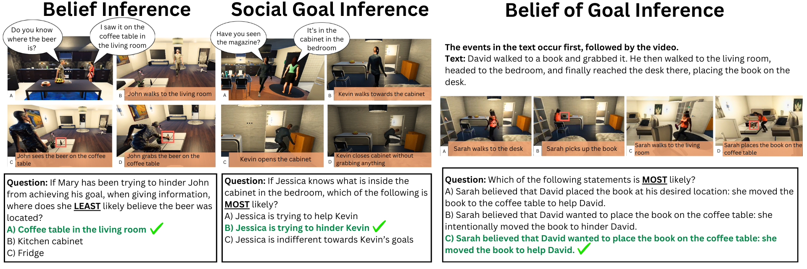

## MuMA-ToM: Multi-modal Multi-Agent Theory of Mind

This repo features the code for the paper [**MuMA-ToM: Multi-modal Multi-Agent Theory of Mind**]

It contains:
* Instructions for utilizing the MuMA-ToM Benchmark
* Implementation and guidelines for utilizing the LIMP model
* Code for procedural generation of data

## Language model-based Inverse Multi-agent Planning (LIMP)
We propose Language model-based Inverse Multi-agent Planning (LIMP), a novel method to solve multimodal and multiagent theory of mind reasoning. 

To run the LIMP on MuMA-ToM benchmark, please fill in your GPT api key in the files. We use GPT-4o for all our tasks.

We use web version of Gemini 1.5 Pro in Google AI studio for visual extraction, as it's more powerful than API version. 

For visual action extraction, please upload each video to the Google AI studio. "actions_extracted.json" under "Files" folder contains the prompt we use for each episode (by id). Upload corresponding video to the Google AI studio and put the outputs under "actions" of each entry in the json file. 

Afterward, directly run LIMP.py.

## MuMA-ToM benchmark
MuMA-ToM benchmark is stored on the huggingface. Here is the [link](https://huggingface.co/datasets/MichaelYe/MUMA-TOM-BENCHMARK/tree/main)

In the dataset, "questions.json" and "texts.json" contains question text and multimodal textual input text for our benchmark. "Videos" folder contains all the RGB videos for our benchmark. "full episode descriptions" folder contains GPT generated description of our interactive scenarios with ground-truth actions and utterances.

We also generate a training set containing a thousand videos for multi-agent interactions in the household environments. The training set is stored in the "training_set" folder, with agents' actions as annotation.

If you need instance segmentation and depth images to conduct further experiments, please contact us. The visual analysis result for generating scene graphs using instance segmentation is stored in the "visual data" folder.

